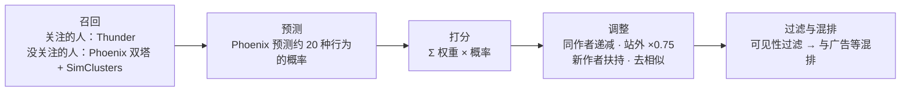
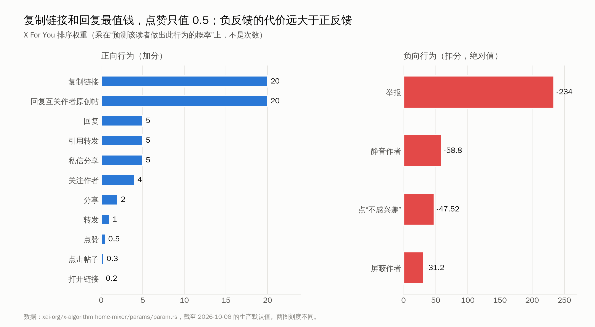
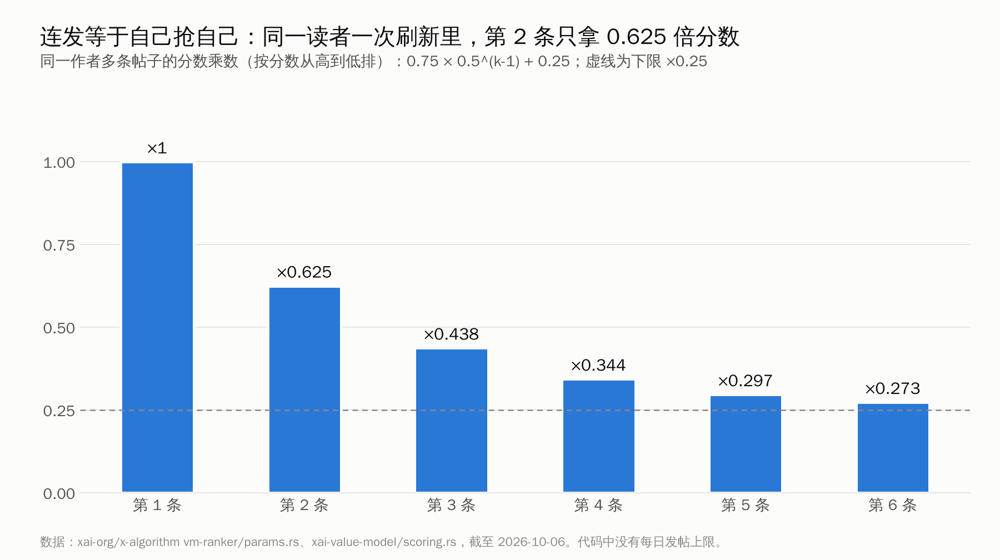
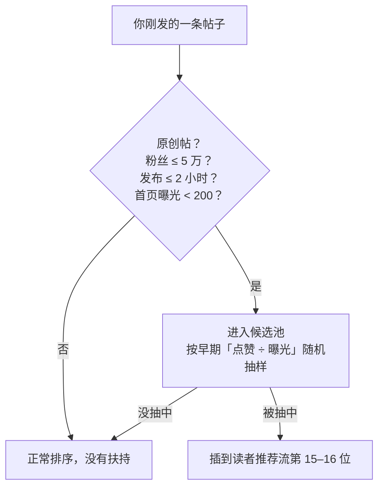
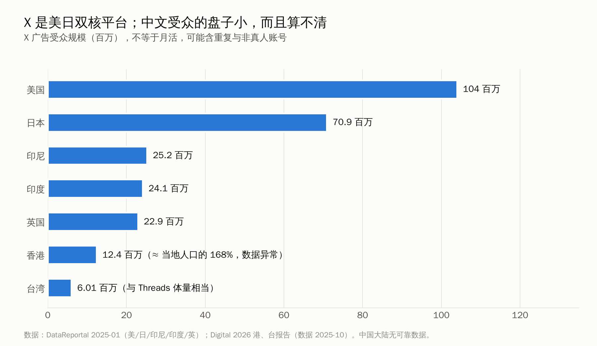

# 点赞只值 0.5：2026 年 X 新规则下的账号运营全指南

> X 在 2026 年把推荐算法交给了 Grok 系模型，代码全部开源，变现也改成只奖励原创。这篇文章对照开源代码、官方条款和大样本数据，把新规则逐条讲清楚：哪些老攻略已经失效，新号怎么起，钱从哪里来，AI 能用到什么程度。

<!-- 图1：封面图 -->

中文圈流传最广的一条推特涨粉秘籍是：**作者回复你的评论，权重等于 75，相当于 150 个赞。** 所以要去大 V 帖子下面抢评论，争取被回复。

这个数字不是编的。它出自 Twitter 2023 年开源的排序模型配置，原文写的是 `reply_engaged_by_author: 75.0`[^tw2023]。问题在于，那份代码三年前就过时了。

2026 年 1 月 20 日，X 在 GitHub 上开源了新的推荐系统 `xai-org/x-algorithm`，8 月又公开了排序权重[^xalgo]。在新代码里，**"作者回复你"这一项根本不存在**。回复的权重是 5，转发是 1，点赞是 0.5。所有正向行为里，权重最高的是一个很少有人留意的动作："复制链接"，权重 20，是点赞的 40 倍[^param]。

这一年 X 改的远不止权重：

- **推荐交给模型**：推荐系统改由 Grok 系模型预测你的行为，人工规则几乎删光。
- **互关加权**：互相关注的人之间被加权。
- **回复区可以"踩"**：Premium 用户可以给回复点"踩"。
- **只奖励原创**：9 月起，变现只奖励原创内容。

你收藏的那些攻略，有多少还能用？

这篇文章想把 2026 年的新规则一次讲清楚。每一条结论都标注了出处，可能是开源代码的具体文件，可能是 X 官方的公告或条款，也可能是数据研究。确认过的写成确认，推断的会说明是推断。文章很长，建议先看下面的一页速查，再按需要跳到对应章节。

> **说明**：文中引用的代码数值，都是截至 2026 年 10 月 6 日 `xai-org/x-algorithm` 仓库里的"生产默认值"。X 会持续调整这些参数，仅 9 月就改过一次点击权重。所以不要把任何一个小数点当成永久规则，本文也不例外。

---

## 先看结论：一页速查

| # | 新规则 | 一句话解释 | 详见 |
|---|---|---|---|
| 1 | **让人想回复、分享、关注，比让人点赞重要得多** | 点赞的权重只有 0.5，回复和引用是 5，复制链接是 20，关注作者是 4 | §1 |
| 2 | **原创帖才能吃到新号扶持** | 粉丝不超过 5 万的作者，原创帖在发布 2 小时内、曝光不到 200 次时，有机会被直接提到推荐流第 15 位 | §3 |
| 3 | **别短时间连发** | 同一个人刷一次，你的第 2 条帖子只拿 0.625 倍分数，第 3 条 0.44 倍；代码里没有日更上限，连发的问题是自己跟自己抢位置 | §1、§2 |
| 4 | **外链没有被降权，但链接帖天然吃亏** | 官方否认降权，代码里也找不到惩罚；但读者点出去后很少回来互动，分数自然低 | §2 |
| 5 | **Premium 不是曝光开关** | 推荐排序代码里没有 Premium 乘数。它的作用在回复区优先、账号信誉和变现资格上 | §3 |
| 6 | **回复要少而精** | 大号帖子下的回复由 Grok 打分，"24 小时回了多少条""是不是粘贴的"都会被看到 | §3 |
| 7 | **互关圈有用，互粉群没用** | 互关作者原创帖的"回复"权重加 15，但群里发链接协调来的互动不计入排序 | §3 |
| 8 | **中文帖会被翻译后推给外国人** | 2026 年 5 月底起，中文帖由 Grok 自动翻译，并跨语言推荐 | §4 |
| 9 | **变现只认原创，回复不计入门槛** | 新的原创内容奖励计划只按原创内容计酬，回复区的曝光不算 | §5 |
| 10 | **AI 可以帮你写，不能替你互动** | X 一边推 Grok 写作，一边清理 AI 自动回复号；被判为 AI 水文的账号，30 天内拿不到站外推荐 | §6 |

**阅读路线**：

- **新号**：先读 §3，再读 §2。
- **想变现**：直接读 §5。
- **已经在做、数据却在下滑**：先读 §1 和 §6，看看是不是踩了新规则的雷。

---

## §1 规则变了什么：读懂 2026 年开源的推荐算法

### 1.1 先分清两份代码

讨论"推特算法"之前，先确认说的是哪一份代码。

**第一份是 2023 年 3 月 Twitter 开源的 `twitter/the-algorithm`。** 网上流传的大部分"权重秘籍"都出自这里：回复 13.5、作者回复 75、蓝 V 在站内 4 倍、站外 2 倍[^tw2023][^tw2023blue]。

**第二份是 2026 年 1 月 20 日 X 开源的 `xai-org/x-algorithm`。** 它是一套重写过的新系统[^xalgo1][^tc-open]。

即使是新代码，信息也是分批公开的：

- **1 月首版**：没有具体权重。代码引用了权重常量，但参数文件不在仓库里[^xalgo1]。
- **2026 年 8 月 13 日**：官方补上了参数文件，权重数值这才第一次公开[^xalgo]。

所以，1 月到 8 月之间那些号称"根据 2026 开源代码算出权重"的文章，数字不可能来自新代码，多半是把 2023 年的旧数字重新包装了一遍。

### 1.2 一条帖子是怎么被推到你面前的

"X 的算法交给 Grok 了"这句话常被理解成"Grok 会一条条读你的帖子，决定推不推"。这个理解只对了一部分。

按照开源仓库的说明，X 的 For You 推荐流水线大致分五步[^xalgo][^phoenix]：

1. **召回**：从两个池子里找候选。
   - 你关注的人最近发的帖子，由名为 Thunder 的组件提供。
   - 你没关注的人的帖子，由 Phoenix 双塔模型和 SimClusters 兴趣聚类找出来。
2. **预测**：排序模型 Phoenix 读取你最近的互动历史，预测你对每条候选帖子做出约 20 种行为的概率：点赞、回复、转发、引用、分享、点开、停留、关注作者、点"不感兴趣"、屏蔽、举报……
3. **打分**：把这些概率乘以各自的权重，再加总，公式是 `最终分 = Σ 权重 × 预测概率`。
4. **调整**：同一作者多条帖子递减、陌生人的帖子打折、扶持新作者、去掉相似内容。
5. **过滤与混排**：去掉违规或不该给你看的内容，再和广告、推荐关注等内容混排。

<!-- 图2：X For You 推荐流水线示意图 -->



*图 2：X For You 推荐流水线（据 xai-org/x-algorithm README 整理）*

**"Grok 驱动"的准确含义有两层。**

- 第一层，Phoenix 用的是 Grok 系的 transformer 架构。2025 年 10 月 Musk 说要"删除所有启发式规则"[^smt-grok]，2026 年的 README 也说已经去掉了几乎所有人工设计的特征[^xalgo1]。
- 第二层，Grok 大模型（代码里叫 Grox）另外负责内容理解、打标签和回复区打分。后面会讲到它在回复区和 AI 水文识别上的作用。

**模型看的是你的读者，而不是你本人。**

Phoenix 对每条候选帖子的输入只有几样：帖子和作者的标识、帖子内容的语义编码，以及时区、当地时间、帖子发布了多久等上下文。代码里没有"作者是否认证"这个特征[^phoenix]。

所以，你的帖子能不能被推出去，取决于模型预测"看到它的这个人"会不会回复、分享、关注你，而不取决于你开没开会员、加没加标签。

### 1.3 权重表：哪些行为值钱

下表是截至 2026 年 10 月 6 日的生产默认权重，来自仓库里的 `home-mixer/params/param.rs`[^param]：

| 正向行为 | 权重 | 负向行为 | 权重 |
|---|---|---|---|
| 复制链接（分享到站外） | **20** | 举报 | **−234** |
| 回复互关作者的原创帖 | **20**（5 + 15） | 静音作者 | −58.8 |
| 回复 | 5 | 点"不感兴趣" | −47.52 |
| 引用转发 | 5 | 屏蔽作者 | −31.2 |
| 私信分享 | 5 | 划过不停留 | −0.02 |
| 关注作者 | 4 | | |
| 分享 | 2 | | |
| 转发 | 1 | | |
| 点赞 | **0.5** | | |
| 点开后的停留时长 | 0.4 | | |
| 点击帖子 | 0.3（9 月 29 日由 0.4 下调） | | |
| 打开链接 | 0.2 | | |
| 视频质量观看 | 0（8 月 25 日由 0.05 下调） | | |

<!-- 图3：2026 年 X 推荐权重条形图 -->



这张表有三种读法。

**第一，"让人想说话、想转出去、想关注你"的内容最值钱。**

点赞只有 0.5，转发只有 1。"求赞求转"式运营在新规则下收益很低。真正有分量的有三类：

- **回复和引用**：5
- **关注作者**：4
- **把链接复制出去、私信发给别人**：分别为 20 和 5

这意味着 X 想要的是**值得被转发到群聊和朋友圈的内容**，比如工具清单、数据图表、能直接拿去用的方法。它看重的不是你在帖子里放了多少外链，而是别人愿不愿意把你的帖子分享出去。

**第二，负反馈的代价远大于正反馈的收益。**

"不感兴趣"是 −47.52，静音是 −58.8，举报是 −234。标题党、引战、蹭不相干的热点，可能多拿到几个赞，但只要让一部分人点了"不感兴趣"或静音，就会被大幅扣分。

**第三，别拿权重做加减法。**

权重乘的是"这个人做出这个行为的预测概率"，而不是行为的次数。仓库 README 专门写了一段话：举报的权重是点赞的 468 倍，并不代表"1 次举报能抵掉 468 个赞"。举报本身极少发生，预测概率非常低，所以给了很大的权重[^xalgo]。

同一段注释还写了一句对中文圈很重要的话：

> "Directly navigating to a post (i.e., coordinating via groupchat) has no ranking impact."

意思是，只有用户在首页推荐流里看到这条帖子、并在那里产生的互动，才会计入推荐系统。**在群里发链接，让大家点进去点赞评论，对排序没有作用**[^param]。

### 1.4 打完分之后，还有几道关

**同一作者的帖子递减。**

同一位读者刷新一次时，系统会把你的几条帖子按分数排好，然后逐条打折，公式是 `0.75 × 0.5^k + 0.25`（k 从 0 开始）[^vmranker]：

- 第 1 条：拿全分
- 第 2 条：0.625 倍
- 第 3 条：0.44 倍
- 第 4 条：0.34 倍
- 最低：0.25 倍

<!-- 图4：同作者多帖衰减 -->



这就是网上"单作者曝光上限"说法的真实来源。但它不是"一天发超过 N 条就限流"，代码里找不到任何每日条数上限。它的实际效果是：**短时间连发，你的几条帖子会在同一个读者面前互相抢位置。** 这组参数（0.5 和 0.25）和 2023 年版完全相同[^tw2023div]，所以"别连发"这条老经验恰好依然成立。

**陌生人看到你，分数打 0.75 折。**

帖子推给不关注你的人时，分数乘以 0.75。另外有一个过滤器，会把"你没关注的人发的回复和转发"从 For You 里去掉[^vmranker][^xalgo]。

这有一个直接的推论：**你在别人帖子下写的回复，不会作为独立内容推给陌生人。想被陌生人刷到，只能靠原创帖。** §3 会接着讲这一点。

**帖子只能活 48 小时。**

发布超过 48 小时的帖子，会被直接排除出推荐候选[^xalgo]。

**被判为"AI 水文"，30 天内拿不到站外推荐。**

这是这次研究里最值得警惕的一个发现。开源的执法规则里有一个 `llm_slop_user`（AI 水文用户）标签。账号一旦被打上这个标签，就会挂上一个为期 30 天的垃圾标签。在这 30 天里，这个账号的帖子在"推荐给不关注你的人"这一场景下会被直接丢弃，只有粉丝还能看到[^enforce][^xalgo]。

换句话说，**被判为 AI 批量产出的账号，增长会直接停止。** §6 会展开讲。

### 1.5 开源代码能告诉你什么，不能告诉你什么

开源不等于完全透明。1 月版发布后，康奈尔、格拉茨、卡内基梅隆三所大学的研究者都批评它"给人一种透明的假象"，因为没有权重、没有训练好的模型、也没有训练数据[^redacted]。8 月更新补上了权重和训练代码，但生产环境的模型参数和真实训练数据仍然不公开[^phoenix]。官方还说明，只有占流量 10% 以上的实验才会出现在仓库里[^xalgo]。

所以，开源代码能告诉你**机制**：

- 系统在预测什么
- 哪些行为加分、哪些扣分
- 有哪些硬性的门槛和窗口

开源代码不能告诉你**结果**：你某一条帖子具体会得多少分，外人无法复现。任何"精确到小数点的爆款公式"都不成立。

正确的用法是两条：

- **按机制调整行为。**
- **每个月去 GitHub 看一次仓库的提交记录。** X 改权重会直接体现在代码里，比读任何二手解读都快。

---

## §2 发什么、怎么发：内容与发帖策略

在新规则下，判断一条内容好不好，标准只有一个：**能不能让对的人停下来、回复、转出去、关注你。**

形式、时间、频率，都是为这件事服务的。先把过时的说法清理掉。

### 2.1 13 条流行说法，逐条核查

| 流行说法 | 结论 | 依据 |
|---|---|---|
| "作者回复你的评论 = 75 倍权重 / 150 个赞" | **已过时** | 来自 2023 年配置[^tw2023]；2026 年代码里没有这一项，回复权重为 5[^param] |
| "回复 13.5、转发 20" 之类的公式 | **已过时** | 混用了旧数字；2026 年转发权重为 1[^param] |
| "开蓝 V / Premium，曝光 ×2 到 ×4" | **在排序代码里找不到** | 来自 2023-03 的旧参数[^tw2023blue]；2026 年的排序代码没有 Premium 乘数（见 §3.4） |
| "外链会被降权，链接要放评论区" | **官方否认，代码里也没有惩罚；但链接帖实际表现确实弱** | 见 2.2 |
| "多加话题标签能获得推荐" | **无效** | 代码里没有标签加权；Musk 公开说"别再用了"[^hashtag] |
| "发布后前 30 分钟决定生死" | **不准确** | 代码里的新号扶持窗口是 2 小时或 200 次曝光（见 §3.1） |
| "一天发超过 N 条就会被限流" | **没有上限，但有同次递减** | 见 1.4[^vmranker] |
| "编辑帖子会被降权" | **没有证据** | 排序和过滤代码里都没有找到与编辑有关的惩罚 |
| "被举报 1 次等于少 468 个赞" | **错误，官方专门驳斥** | 权重乘的是概率，不是次数[^xalgo] |
| "进互赞群，在群里发链接互相点" | **对排序无效** | "Directly navigating to a post … has no ranking impact"[^param] |
| "发视频天然有加权" | **目前不成立** | 视频质量观看的权重 8 月下调为 0；视频靠停留和点开拿分[^param] |
| "存在一个固定的黄金发帖时间" | **没有写死的规则** | 模型会把"当地时间"当作特征，学的是你的受众的习惯[^phoenix] |
| "Grok 逐条读帖决定推不推" | **部分正确** | Grok 负责打标签和回复区打分，For You 的主排序靠 Phoenix 预测行为概率 |

### 2.2 链接到底能不能放

这是争议最大的一个问题，两边的证据都很硬。

**说没有降权的一方：**

- 开源代码里没有针对链接的惩罚，"打开链接"的权重反而是 +0.2[^param]。
- X 时任产品负责人 Nikita Bier 在 2025 年 10 月发帖说"Links are not deboosted"[^bier-links]。
- 2026 年 7 月 29 日，Musk 在回复 Paul Graham 时说："We haven't for over a year."[^musk-links]

**说链接帖表现差的一方：**

Buffer 分析了 7.1 万个账号的 1,880 万条帖子（2024 年 8 月至 2025 年 8 月），发现从 2025 年 3 月起[^buffer-links]：

| 账号与帖子类型 | 中位互动率 |
|---|---|
| 非 Premium 账号的链接帖 | **0%** |
| Premium 账号的链接帖 | 约 0.28% |
| Premium 账号的纯文本帖 | 约 0.90% |

这两种说法可以同时成立。Bier 自己给过解释：读者点开链接、去看网页后，常常忘了回来点赞和回复，系统拿不到互动信号[^bier-links]。X 后来在 iOS 内置浏览器底部加了一排常驻的点赞和回复按钮，就是为了解决这个问题[^gigazine-links]。

所以准确的说法是：**没有硬性降权，但模型按"预测你会互动"打分，而链接帖天然拿不到互动。**

另外要注意，2026 年下半年还没有独立的对照数据。

**实操上：**

- **主帖必须能独立成立。** 读者不点链接，也能拿到核心信息：结论、数据、清单。
- **链接放正文还是评论区，影响不大。** 2026 年 7 月 Bier 明确说过"不需要再把链接放评论区了"[^musk-links]。
- **要导流的长内容，优先写成 X 的 Articles（长文）。** 内容留在站内，就不会让读者跳出去。

### 2.3 形式、时间、频率

**形式：纯文本仍然最强。**

Buffer 2026 年度报告统计了 5,200 万条以上的帖子（2024 年 1 月至 2025 年 12 月）。X 平台各形式的中位互动率如下[^buffer-2026]：

| 形式 | 中位互动率 |
|---|---|
| 纯文本 | 3.56% |
| 图片 | 3.40% |
| 视频 | 2.96% |
| 链接 | 2.25% |

文本和图片相差不大，链接垫底。视频方面，前面说过"视频质量观看"的权重已经下调为 0。代码里看不到视频天然加权的证据，视频要靠吸引人停留和点开拿分。

**时间：周中好、周六差，具体几点以自己的数据为准。**

几家大样本研究在"哪几天"上意见一致：周二到周四最好，周六最差。在"几点"上有分歧：

| 研究 | 样本 | 最佳时段 |
|---|---|---|
| Buffer | 870 万条帖子 | 工作日上午 9 到 11 点[^buffer-time] |
| Hootsuite | 100 万+ 条帖子 | 工作日上午 9 到 11 点[^hootsuite] |
| Sprout Social | 约 20 亿次互动 | 周二到周四中午 12 点到下午 6 点[^sprout] |

这些时间都按**受众所在地的当地时间**计算。

开源代码里没有写死的黄金时段，"当地时间"只是模型的一个输入特征[^phoenix]。所以最可靠的做法是看自己后台的粉丝活跃时间。

给中文创作者的换算：

- **面向大中华区读者**：以工作日上午和午休为主。
- **面向美国读者**：美东时间上午 9 到 11 点，大约是北京时间晚上 9 点到午夜（夏令时）。也就是说，你在晚上就能赶上英文读者的上午。

**频率：每天 1 到 3 条主帖，拉开间隔，长期坚持。**

需要说明一点：目前**没有**找到 2025 到 2026 年针对 X 的"发帖频率与单帖曝光"大样本研究。上面这个建议是根据机制推断出来的。

推断的依据有两条：

1. **同作者递减**：同一位读者一次刷新里，你的第 2 条只拿 0.625 倍分数[^vmranker]。所以把主帖间隔几个小时发，比集中连发划算。
2. **坚持带来的差距**：Buffer 跟踪了 10 万多名用户 26 周，坚持发帖的人单帖互动是零散发帖者的 5 倍以上。不过这项研究不分平台[^buffer-consistency]。

回复不进入陌生人的推荐流，所以不受同作者递减影响。但回复数量本身会被风控看到，这一点 §3 会讲。

### 2.4 写给中文创作者的四条约束

**第一，首屏只显示约 140 个汉字。**

X 的长帖在信息流里只显示前 280 个"加权字符"，中日韩文字每个字算 2 个字符[^charcount]。所以中文长帖的首屏大约只能放 **140 个汉字**，超出部分要读者点"显示更多"才能看到。英文写作指南不会提这件事，但它决定了中文帖的钩子要写多短。

**第二，主时间线不显示加粗，也别靠话题标签。**

2024 年 10 月起，加粗只在帖子详情页显示，主时间线上看不到[^bold]。Musk 在 2024 年 12 月发帖："Please stop using hashtags."[^hashtag]

信息流里的排版要靠**分行和空行**来完成。

**第三，你的中文帖可能被翻译给外国人看。**

2026 年 3 月底起，X 用 Grok 自动翻译外语帖子，并把它们推荐给其他语言的用户。中文大约在 5 月底开通[^bier-translate][^ithome-translate]。

所以写作时要少用只有中文语境才懂的谐音、缩写和梗，翻译过去以后外国读者看不懂，还可能引起误解。§4 会专门讨论这件事带来的机会。

**第四，争取的是"不后悔的停留"。**

Musk 在 2025 年 1 月说，推荐的目标是"unregretted user-seconds"，也就是用户不后悔花掉的时间[^unregretted]。代码里既有"停留"和"点开后停留时长"这样的正向项，也有"划过不停留"这样的负向项，再加上很重的负反馈权重。

靠情绪煽动换来的停留，往往伴随着"不感兴趣"和静音，最后得不偿失。

### 2.5 三个写法模板

下面三个模板是根据上面的机制和数据**归纳出来的结构**，没有人做过 A/B 测试，用的时候请结合自己的数据调整。

**模板一：140 字钩子长帖**

适合 Premium 用户，用来拿单帖曝光和停留时长。

```
第 1 段（≤140 字）：具体结论或反常识判断，带数字或具体对象
第 2 段：读者能从这条帖子里得到什么
——（以下需要点"显示更多"）——
3–6 个短段：每段一个论点 + 一个例子或证据，段与段之间空一行，不用加粗
结尾：一个能具体回答的问题（不要问"你怎么看？"）
```

为什么这样写：

- 首屏只有约 140 字，结论必须放在最前面。
- 点开"显示更多"后的停留时长有正向权重。
- 结尾提一个具体问题，是为了换回复（权重 5）。

**模板二：独家数据长文 + 摘要主帖**

用来拿原创分和变现。

```
Articles 长文：标题 = 具体发现；开头三句给结论；
  正文按"数据从哪来 → 发现 1/2/3 → 方法与局限"组织；图表自己做
主帖：3–5 条要点摘要，不点开也有价值，附长文卡片
发布后 1 小时内：认真回复前几条有内容的评论
```

依据有两条：

- **官方在扶持长文**：2026 年 1 月，Articles 开放给所有 Premium 用户[^articles]。X 随后拿出 100 万美元奖励"最佳文章"，冠军 @beaverd 写的是基于自建数据库的德勤政府合同调查，据报道曝光约 4,400 万次[^1m-article][^1m-winner]。他不是百万粉大号，赢在**独家数据和原创调查**。
- **新的变现规则只奖励原创**（见 §5）。

**模板三：Thread 步骤拆解**

用来拿深度互动和收藏。

```
1/ 钩子：一个具体问题或结果 + "下面拆成 N 步"
2/ 到 N-1/：每条讲一步或一个案例，每条单独拿出来也能看懂（方便被单独转发）
N/ 总结 + 一份可执行清单 + 一个问题
```

要注意，Thread 发出后不能编辑，发之前务必校对。

---

## §3 冷启动：从 0 到 1,000，再到 1 万

新号起步可以概括成一句话：**回复负责拉新，原创负责吃扶持，真实的互关圈负责放大。** 刷量这条路，在代码层面没有效果，在规则层面属于违规。

### 3.1 写进代码里的新号扶持

开源代码里有一个"新作者冷启动扶持"（New-Author Boost）[^coldstart][^xalgo]，这是这次研究里对新号最有用的发现。

一条帖子同时满足下面五个条件，就有资格被扶持：

1. 是**原创帖**，不是回复，也不是转发；
2. 作者粉丝数**不超过 5 万**；
3. 发布**不超过 2 小时**；
4. 在首页的曝光**不到 200 次**；
5. 本来的排名不在最末尾的 3% 之内。

同一位读者每刷新一次，系统最多从符合条件的帖子里挑一条，直接插到推荐流的**第 15 到 16 位**。挑选方法是一种随机抽样（Thompson 采样）。系统先假设每条新帖的点赞率大约是 1.5%，再用这条帖子在首页的实际"点赞数 ÷ 曝光数"去更新估计。早期点赞率越高，被抽中的概率越大[^coldstart]。

<!-- 图5：新号冷启动扶持示意（5 个条件 + 插入第 15 位） -->



*图 5：新作者冷启动扶持（据 home-mixer/scorers/author_cold_start.rs 整理；每次刷新最多扶持 1 条）*

这对新号有三个直接的含义。

**第一，每条原创帖都有一次试推的机会。** 回复和转发没有。只回复、不发原创的新号，等于把这个窗口白白放掉了。

**第二，前 200 次曝光里的点赞率，比点赞总数更重要。** 帖子发出去后，最早看到的是你的粉丝，以及被推荐系统试探性推送的人。这一批人的反应决定了它能不能被选中。所以原创帖的开头要对准你最核心的那群读者，不要为了"出圈"写得四平八稳。

**第三，"前 30 分钟决定生死"在代码里没有依据。** 代码里的窗口是 2 小时或 200 次曝光，先到哪个算哪个。

需要提醒的是，代码里给这个功能做了实验分组，说明它还在测试阶段，力度和覆盖范围随时可能调整。

### 3.2 回复策略：少而精

"去大号下面回复"仍然是新号拉新的主要手段，我们找到的几份公开起号复盘，都把它排在第一位[^jon][^dee][^innmind]。

但它起作用的路径和很多人想的不一样。

前面讲过，你没关注的人发的回复，不会进入你的 For You。同样，**你的回复也不会作为独立内容推给陌生人**[^xalgo]。对陌生人来说，你的回复只会出现在一个地方：对方帖子下面的回复区。读者在回复区看到你，被吸引后点进你的主页，然后关注你。这才是完整的路径。

所以有两件事最关键：你的回复能不能排到回复区前面，以及你的主页能不能把访客留下来。

关于回复区排序，开源代码透露了两个重要信息。

**大号帖子下的回复由 Grok 打分。** 如果被回复的帖子或楼主粉丝超过 25 万，系统会用 Grok 系模型给每条回复打 0 到 3 分。模型能看到这些信息[^grox][^grox2]：

- 回复者的粉丝数；
- 回复者**过去 24 小时回复了多少条**；
- 回复者过去 24 小时被屏蔽了多少次；
- 这条回复**是不是粘贴进去的**。

得 0 分的回复会被打上"高曝光风险回复"的标签。可信度高的账号可以豁免，新号通常达不到这个门槛。打分用的提示词没有公开，官方的理由是"减少被钻空子的可能"。

**回复区可以被"踩"。** 2026 年 3 月起，X 在回复区加了"踩"，目前只有 Premium 用户能用。反馈理由里专门有"AI 生成"和"垃圾信息"两项。官方说它主要是一个个性化的偏好信号，同时简化了举报流程[^downvote]。

把这两点放在一起看，"一天回复 200 条"的老攻略，正好撞在风控能看到的信号上。2026 年 2 月，X 还限制了通过 API 发回复：只有对方 @ 了你或引用了你，才能用 API 回复他[^api-reply]。用工具自动回复大号这条路，基本已经堵死了。

**实操建议：**

- **数量**：每天 10 到 20 条，每条都要有增量，比如补充一个数据、给出一个反例、分享一段亲身经验。不要写"说得太对了"。
- **对象**：优先找同赛道、粉丝在 5,000 到 10 万之间的账号。他们的回复区还没被挤满，你的回复更容易被看到，也更容易被楼主回复。英文独立开发者 Dee Kargaev 公开复盘过这套做法：30 天从 0 涨到 500。他同时说，用 AI 生成回复、大量关注别人，这两种做法都没用[^dee]。
- **写法**：自己写，不要粘贴。"是否粘贴"本身就是打分模型能看到的信号。

### 3.3 互关圈：真实对话才有用

2026 年 7 月，X 上线了**互关加权**。如果你和读者互相关注，你发的**原创帖**里"预测对方会回复"这一项，权重从 5 提到 20。7 月 24 日，官方以世界杯期间用户看不到足够多站外讨论为由，把加成从 +20 下调到 +15，所以现在是 5 + 15 = 20[^bidir][^engadget-mutual]。

关于这次改动，媒体普遍报道成"回复区优先显示互关好友"[^engadget-mutual]。但开源代码里的实现，是作用在 For You 的原创帖上。回复区的排序代码不在开源仓库里，两种说法可能同时成立。本文以代码为准。

这个加成的关键在于，**它乘的是"对方真会回复你"的预测概率**。如果互关对象跟你没有任何交流，这个概率本来就接近 0，乘完还是接近 0。所以互关有没有用，取决于对方是不是真的会跟你说话。

由此可以推出三个结论：

- **和同领域、会真实交流的创作者互关，现在有实打实的收益。** 你们之间的原创帖会更容易出现在彼此的推荐里。
- **互粉群、互赞群没有用。** 前面讲过，群里发链接、直接点进帖子去互动，对排序没有影响[^param]。另外，X 计算账号信誉时，会把被认定为关联小号之间的互动剔除[^usercred]。
- **组织化的互关和互刷属于违规。** X 的平台操纵政策明文禁止买卖粉丝和互动、"大量关注再取关"刷粉，以及"协调交换互动"（coordinating to exchange engagement），处罚从锁号到封号不等[^manip][^automation]。自然的互相关注没有问题，有组织地交换关注和点赞就越线了。

### 3.4 Premium 值不值得开

先说结论：**Premium 不是曝光开关，而是回复区、信誉和变现的杠杆。想变现就必须开；单纯涨粉，要看你多依赖回复。**

**代码里能找到的：**

- 2026 年的排序代码里，没有任何"Premium 作者乘以几倍"的逻辑。排序模型的输入里也没有"是否认证"这一项[^phoenix]。
- Premium 在代码里唯一明确的作用，在账号信誉系统里。这个系统用 PageRank 计算账号可信度，初始权重只发给 Premium 和认证账号。它的用途是豁免部分自动处罚，不是给排序加分[^usercred]。

**官方说明里写到的：**

- 各档 Premium 都有"回复优先"，档位越高力度越大[^premium]。
- 回复区的"踩"和变现资格都需要 Premium；据第三方介绍，完整的账号数据面板也只对 Premium 开放。

**数据里看到的：**

Buffer 分析了 1,880 万条帖子，按单帖曝光中位数比较[^buffer-premium]：

| 账号类型 | 单帖曝光中位数 |
|---|---|
| 免费账号 | 不到 100 |
| Premium | 600 以上 |
| Premium+ | 1,550 以上 |

但这是相关性，不是因果。愿意付费的人本来就更活跃，而且这批数据早于 2026 年的新算法。

**怎么选：**

- **准备靠回复起号**：Premium 的回复优先是实打实的放大器，建议开。
- **准备变现**：没有 Premium 申请不了分成，必须开。
- **单纯想发原创看看效果**：可以先不开。拿 2 到 4 周的数据做基准，再开通对比。

### 3.5 案例与阶段节奏

下面四个案例都是作者本人的公开复盘，数据无法核实，看做法比看数字更有用。

| 案例 | 赛道 | 时间与结果 | 主要做法 |
|---|---|---|---|
| @JonBuildsHQ[^jon] | 独立开发 / SaaS | 2026 年 5 月，14 天，30 → 1,000+ | 以回复为主，高峰日回复 250+ 条、原创 18 条；分析头部账号的爆款结构 |
| Dee Kargaev[^dee] | AI / 开发 | 2025 年 6 月起 30 天，0 → 500 | 每天 15 到 20 条有增量的回复，专挑 5K 到 10 万粉的账号；明确说 AI 回复没用 |
| 鸭哥 yage.ai[^yage] | AI / 技术（中文作者） | 2026 年 2 月到 5 月，约 3 个月，171 → 4,813 | 原创发帖交给自建的 AI 系统，自己每天花 2 分钟挑选题 |
| Innmind 的 20 个创业账号[^innmind] | 创业 / 科技 | 每个账号用 8 个月以上，0 → 约 2 万 | 0 到 3K 主要靠回复；3K 到 5K 是转折点；持续发帖是最强的预测因素 |

两点说明。第一个案例日回 250 条，发生在回复打分模型公开之前，作者没有讲后续，**不建议照搬这个数量**。第三个案例是"AI 托管原创发帖"，不是 AI 自动回复，两者在规则上的性质完全不同，§6 会讲。

结合机制和案例，可以整理出一张节奏表。它是经验总结，不是官方标准：

| 阶段 | 每天做什么 | 重点看的指标 |
|---|---|---|
| **0 → 1,000** | 10 到 20 条有增量的回复（拉新）+ 1 到 2 条原创帖（吃扶持）；主页的简介和置顶帖写清楚"关注我能得到什么" | 主页访问 → 新增关注的转化率；哪类回复带来的主页访问最多 |
| **1,000 → 1 万** | 原创比重提高到 1 到 3 条，每周 1 篇 Article 或 Thread；和 10 到 30 个同领域创作者形成真实的互相回复关系 | 原创帖的平均曝光和互动率；互关对象的回复率；被复制链接和私信分享的次数 |
| **1 万以上** | 逐步超出新号扶持的范围（粉丝上限 5 万）；靠内容资产和系列化栏目留住读者 | 认证用户曝光（与变现门槛挂钩）；关注转化率 |

**怀疑自己被限流时**，先别去找第三方的"限流检测"工具。X 在 2026 年 8 月上线了官方自查工具 Under the Hood（地址 x.com/i/jf/under_the_hood），可以看到自己的账号或帖子被打了哪些影响可见度的标签。它还在试点阶段，要求近一个月发帖 10 条以上，初期只开放给注册满一年的账号[^xalgo][^underhood]。

---

## §4 写中文还是写英文

2026 年，这个问题的答案变了。过去是"选哪种语言"，现在是"用哪种语言你写得最好、最像你自己"，因为平台会帮你翻译。

### 4.1 先看受众盘子

X 是一个以美国和日本为核心的平台。按 DataReportal 2025 年 1 月的广告受众数据，美国 1.04 亿、日本 7,090 万，之后是印尼、印度、英国，各在 2,000 多万[^dr-global]。

中文受众主要由四部分组成：

- **台湾**：约 601 万广告受众，跟 Threads 在台湾的体量差不多[^dr-tw]。
- **香港**：1,240 万，相当于香港总人口的 **168%**[^dr-hk]。DataReportal 自己也提示这个数字异常。合理的推测是，大量通过香港节点上网的中国大陆用户被算进了香港，但这一点没有一手证据。
- **中国大陆的翻墙用户**：唯一的官方估计还是 2016 年 Twitter 说的"约 1,000 万"[^tw-china]，已经过去十年。
- **海外华人**：没有可靠数据。

<!-- 图6：X 广告受众规模 -->



结论很简单：**英文区的规模远大于中文区；中文区的盘子到底多大，没有人说得清。**

### 4.2 自动翻译改变了什么

2026 年 3 月底，Musk 宣布 Grok 开始"自动翻译并推荐"其他语言的帖子，日语首先上线[^gigazine-jp]。4 月 7 日，Nikita Bier 宣布全球推开，原话是"give posts in any language global reach"[^bier-translate][^tc-translate]。中文大约在 5 月底开通[^ithome-translate]。

这件事有两面。

**一面是破圈的机会。** 一位日本漫画家的日语帖子，被翻译后拿到约 2,400 万次浏览。Bier 公开鼓励创作者"用自己的语言写自己的文化和日常"[^unseen-jp]。

**另一面是被误读的风险。** 《游戏人生》作者榎宫祐批评自动翻译"会随意改写原意"，他的批评帖获得约 8.4 万赞[^unseen-jp]。目前关闭翻译的开关只在读者那一侧，**作者没法禁止自己的帖子被翻译**。

对中文创作者来说，"写中文就只有中文读者"这个前提已经不成立了。但跨语言推荐究竟能带来多少流量，目前**没有任何公开数据**。

### 4.3 怎么选

| 你的情况 | 建议 |
|---|---|
| 内容的价值依赖中文语境：大陆时事、中文互联网文化、面向华人的出海/留学/移民服务、中文币圈社区 | **写中文**，把翻译带来的外溢流量当成额外收获 |
| 内容本身国际通用：AI 工具、独立开发、编程、设计、美股；英文写作能达到母语者的八成水平 | **英文为主**，或开英文主号。英文区的盘子大得多，build in public 等社区也成熟 |
| 英文写作明显吃力，只能靠机器翻译 | **不要专门开一个发机翻内容的英文号**。先把中文写好，平台会翻译；看起来像 AI 写的内容会掉信任（§6） |
| 想用"中国视角"讲中国和亚洲 | 中英文都可以，这正是 X 官方鼓励的方向 |

**几种双语做法的利弊：**

- **同一条帖子里中英双语**：字数翻倍，在信息流里读起来别扭；平台又已经自动翻译，收益有限。
- **中文号和英文号分开运营**：可以按受众分别写，但精力也翻倍。注意两个号之间不要互刷，平台规则禁止多账号协调互动[^manip]。
- **先写中文，再人工改写成地道英文发英文号**：可行。关键在"人工改写"，直接贴机器翻译不行。

最后说一个常见的说法："写英文更赚钱。"它**目前没有证据**。X 的分成按 Premium 用户的曝光计算，但各国 Premium 用户的分布没有公开数据，中英文商单的报价差异也没有可靠统计。这句话可能是对的，但现在还只能算一个假设。

---

## §5 变现：新规则下钱从哪里来

平台分成在 2026 年变成了一种"原创奖励"。门槛数字看起来降了，但计算口径也一起变了；规则一年里改了四次；对中国大陆的创作者，还有合规风险。**把 X 当作获客渠道，比把它当成工资更稳。**

### 5.1 原创内容奖励计划（OCR）规则全解

2026 年 8 月 7 日，X 停止接受旧"创作者收入分成"计划的新申请，同时宣布推出 **Original Content Rewards（原创内容奖励，下文简称 OCR）**。旧计划的收益计算到 9 月 7 日，最后一笔款项大约 9 月 11 日到账。9 月 8 日起，旧计划的成员需要**重新申请**才能加入新计划，不会自动迁移[^ocr][^tc-ocr]。

**申请资格**[^ocr][^ocr-terms]：

- 年满 18 岁，所在国家或地区在支持范围内；
- 订阅 Premium、Premium+ 或 Premium Business（**Basic 不行**）；
- 至少 **500 个认证粉丝**；
- 过去 90 天内，来自认证用户的首页曝光至少 **50 万次**，**回复区的曝光不算**；
- 经常发布原创内容。

在 Creator Studio 里提交申请，3 个工作日内出结果。

**怎么算钱**[^ocr][^ocr-terms]：

- 只算 Premium 用户（包括 Basic）在**首页时间线**上看到你帖子的去重曝光，而且帖子至少要有 50% 出现在屏幕上。
- **只给原创内容计酬。**
- 付费推广带来的曝光不算。
- 每两周付款一次，最低 30 美元起付。
- 美国以外的创作者通过 Stripe 收款。X Money 从 9 月 2 日起只对美国创作者强制使用[^xmoney][^tc-xmoney]。
- 官方没有公布单价，也没有公布资金池有多大。

**什么算原创。** 官方给了一个自检问题："如果去掉我的贡献，这条内容还有价值吗？"

- **算原创**：自己写的帖子、Thread、长文、分析、报道；自己拍的照片和视频；自己做的梗图和图表；有实质增量的评论。
- **不算原创**：照搬、下载后重新上传、自动化生成或发布、只描述画面的字幕、标了出处却没有评论的搬运；裁剪、加滤镜、加水印这类处理"通常不构成实质改造"[^ocr]。

**即使入选了，下面几类内容也不计酬**[^ocr]：

- 专门讲"变现教学、怎么多拿分成"的内容；
- 被社区笔记标注为有误导的内容；
- 反复要求读者点赞、回复、转发的内容。

这里有两个容易被忽略的点。

**第一，"门槛降了 10 倍"是错觉。** 旧计划要求"3 个月 500 万次自然曝光"，新计划要求"90 天 50 万次认证用户的首页曝光，不含回复"。两个数字的口径完全不同。如果你的读者里付费用户很少（中文账号大概率如此，这是推断），实际门槛可能没降多少。而且回复区的曝光不再计入，靠在大号下面刷回复来冲门槛，已经行不通了。

**第二，中文 X 上最常见的两类内容拿不到钱。** 一类是"搬运外网视频加中文字幕"，属于搬运；一类是"晒推特工资、教你拿分成"，属于变现教学。

### 5.2 能赚多少

**官方从来没有公布过单价。** 网上流传的"每百万次 Premium 曝光大约 8 到 12 美元"，都来自营销博客和计算器网站，方法不透明，只能作参考。

能找到的中文数据，是一个社区网站收集的 76 位中文创作者**自己公开晒出的**单期收益（旧计划时期）[^payouts]：

- 最近一期（两周）的中位数约 **706 美元**；
- 收入最高的几位都是加密货币和交易类账号，单期 1.4 到 1.6 万美元；
- AI 类账号多在几百到一千多美元之间。

这组数据有明显的幸存者偏差：赚得少的人一般不会晒。

再看一个反面的例子。2024 年 11 月，有人转述一位 75.8 万粉的中文账号单期只拿到 **29 美元**，同期一位 11 万粉的英文博主拿到 6,627 美元[^cn-2024]。粉丝数和收入关系不大，决定收入的是**付费用户刷到你的次数**，这又和赛道高度相关。

至于新计划 OCR 实际能拿多少，首批转入者 9 月 25 日才收到第一笔钱，**目前还没有任何可靠数据**。任何"新计划比旧计划多赚或少赚百分之几"的说法，都没有依据。

### 5.3 中文创作者的现实约束

**支持地区。** 根据 X 帮助中心的页面摘要，OCR 的支持地区包括香港、台湾、新加坡、马来西亚等，**不包括中国大陆**[^ocr-help]。帮助中心的页面我们没能直接打开，这一点只来自搜索引擎的摘要，请你在浏览器里自己核实。

**"Stripe 地区填香港"的风险。** 中文教程里流传一种做法：大陆用户把 Stripe 的地区选成香港，再提现到香港银行卡[^stripe-hk]。但 OCR 条款要求你提交的信息"真实、准确、完整"，如果支付方因故无法付款，余额会被"自动放弃"[^ocr-terms]。按条款字面理解，**这条路有合规和资金双重风险，本文不推荐。** 真正住在港澳台或海外的创作者没有这个问题。

**税务。** 条款要求向支付方提交税务信息，X 有权依法预扣税款。网上常说"填 W-8BEN，预扣税从 30% 降到 10%"，但 X 没有就非美国创作者的预扣税率给出官方说明。请如实填写，以 Stripe 后台的实际扣款为准，并留意你所在地自己的申报义务。

**规则一年改了四次。** 条款写明，X 可以"随时自行决定修改或取消本计划"[^ocr-terms]。2026 年内的变化：

| 时间 | 变化 |
|---|---|
| 1 月 | 宣布分成池扩大一倍以上 |
| 3 月 25 日 | Bier 宣布分成要给"本地区的曝光"更高权重；几小时后 Musk 回复"暂停推进，待进一步考虑"[^region][^region-pause] |
| 4 月 | 聚合号的分成砍到 60%[^tc-clickbait] |
| 8 月 | 整个计划被 OCR 替换 |

第二条值得中文创作者特别留意。很多中文账号的付费读者分散在美国、日本和东南亚，而大陆本地几乎没有合规的付费用户群。地区加权一旦重启，中文账号受到的冲击会比大多数语种都大。它目前只是"暂停"，并没有取消。

### 5.4 变现路径对比

| 路径 | 门槛 | 收益量级 | 适合谁 | 中文创作者可行性 |
|---|---|---|---|---|
| **OCR 平台分成** | Premium + 500 认证粉丝 + 90 天 50 万认证曝光 | 官方不公布；中文晒单中位数约 706 美元 / 两周（偏差大） | 写原创评论、分析、长文，自己做视频的人 | 港台和海外可行；大陆有合规风险；搬运号和翻译号基本拿不到 |
| **创作者订阅** | 2,000 个 Premium 活跃粉丝 + 3 个月 500 万自然曝光[^subs] | 帮助中心称 X 不抽成，创作者最多拿约 97% | 有铁杆读者的垂直专家 | 门槛高，收款方式同 OCR |
| **品牌商单** | 有垂直受众即可 | 通用赛道：1 万粉以下每条几美元到几十美元；加密赛道：1 万粉以下每条 200 到 500 美元，10 万粉以上 2,500 到 5,000 美元（营销机构报价，仅供参考）[^kol][^kol-crypto] | 加密、AI 工具、出海 SaaS 赛道 | **中文区最主要的现金来源之一**；需要标注广告，警惕项目方的合规风险 |
| **Newsletter / 私域** | 没有门槛 | beehiiv 平台数据：付费订阅中位定价每月 10 美元，免费转付费的中位转化率 0.62%[^beehiiv] | 写长文和深度内容的人 | 海外读者用 Substack、beehiiv；大陆读者更习惯公众号、微信群、知识星球 |
| **产品 / 课程 / 咨询 / 社群** | 需要专业积累和信任 | 自述案例：咨询 200 元 / 30 分钟（仅供参考）[^yohei] | 有专业积累的个人 | 可行性高，收入完全归自己，不受 X 规则影响 |

按 beehiiv 的中位数粗算，1 万个免费订阅者大约能转化出 62 个付费用户，每月约 620 美元。这和中文晒单里 X 分成的量级差不多，区别在于**这笔钱和读者关系都留在你自己手里**。

一位中文博主说得很直接："分成只能算外快，不能算生意。"[^yohei] 比较稳的组合是：X 负责获客，分成和订阅作为补充，收入主体放在商单、私域和自己的产品上。

---

## §6 AI 辅助运营：红绿灯

X 划的线不是"用不用 AI"，而是"**有没有人在环里**"。

### 6.1 X 在打击什么

X 一边推 AI 写作，一边在清理 AI 账号。先看清理这一边，下面的数字都来自 X 方面的自述：

| 时间 | 动作 |
|---|---|
| 2025 年 10 月 | 一周清理 170 万个刷回复的 bot[^bots-17m] |
| 2026 年 1 月 | 吊销"发帖换奖励"类应用（InfoFi，如 Kaito）的 API 权限，理由是它们制造了大量"AI 水文和回复垃圾"[^infofi] |
| 2026 年 2 月 | 限制用 API 发回复[^api-reply] |
| 2026 年 3 月 | 回复区开始测试"踩"，理由选项里有"AI 生成"[^downvote] |
| 2026 年 4 月 | Bier 称每分钟识别并封禁 208 个 bot[^bots-208] |
| 2026 年 7 月 | 清理 4.2 万个用聊天机器人自动回复的账号[^bots-42k] |

2026 年 7 月那次清理时，Bier 说了一句话，基本就是 X 对 AI 的立场："using AI to programmatically engage with users without a human in the loop runs counter to our mission"。意思是，没有人在环里、用 AI 程序化地和用户互动，违背 X 的使命[^bots-42k]。

再加上 §1 讲过的"AI 水文"标签：一旦被判定，30 天内拿不到站外推荐[^enforce]。

与此同时，X 自己也在推 AI 写作工具：

- 发帖框里的 Grok 可以帮你校对和改写[^grok-enhance]；
- Grok 可以生成图片，iOS 上可以用自然语言改图[^tc-translate]；
- 美国区在试点"Grok 模板奖励"[^grok-template]；
- 提供可选的"Made with AI"标签。目前只有武装冲突类 AI 视频必须标注，不标会被暂停分成 90 天[^ai-label]。

这两边并不矛盾。**AI 帮你写、你自己审过再发，是被鼓励的；AI 替你去互动，是被打击的。**

### 6.2 红绿灯

**🟢 放心用**

- 用 AI 找选题、查资料、列提纲；
- 用 AI（包括 X 自带的 Grok）校对、精简你自己的草稿，审完后手动发出；
- 用 AI 分析你导出的数据、复盘爆款帖；
- 用排期工具定时发布**你自己写的**原创帖。自动化规则允许这类自动发帖[^automation]；
- 用 AI 生成配图，并主动打上"Made with AI"标签。

**🟡 谨慎用**

- **把中文帖用 AI 翻成英文直接发**：会有 AI 腔，平台本身也已经在自动翻译；
- **让 AI 写全文、自己只改几个字**：内容同质化，而且 OCR 只奖励"实质性的原创价值"；
- **AI 生成的时事、新闻类图片或视频**：容易被社区笔记标注；冲突类内容必须标注；
- **让 AI 起草回复，再逐条手动发**：规则上算"人在环"，但回复量大、风格单一的话，容易被读者"踩"成"AI 生成"；
- **第三方工具里的"自动私信、自动转推"**：开启前逐条对照自动化规则。规则要求，自动私信必须事先取得对方同意[^devpolicy]。

**🔴 不要碰**

- **AI 回复机器人**：自动生成并发出回复。规则原文要求部署 AI 回复 bot 必须事先获得 X 的"书面明确批准"[^automation]；
- **按关键词自动回复、自动 @ 大号**：规则明文禁止；
- **自动点赞、自动关注和取关**：规则明文禁止[^automation]；
- **互赞群、互转群、多账号互刷**：属于"协调交换互动"[^manip]；
- **用 AI 批量搬运、汇编、洗稿**：OCR 明确排除这类聚合内容，账号还可能被打上 AI 水文标签。

### 6.3 读者也在给 AI 打分

平台在识别 AI，读者也在识别。

- **Pew 2025 年 6 月调查**：5,023 名美国成年人中，76% 认为"分辨内容是 AI 还是人做的"非常重要，53% 对自己能分辨出来没信心[^pew]。
- **Raptive 委托的调研**：读者只要**以为**内容是 AI 写的，信任度就下降近一半，不管它实际上是不是 AI 写的[^raptive]。

这两份调研的样本都在美国，目前还没有针对中文读者的同类数据。但回复区"踩"的理由选项里专门有"AI 生成"，这说明 X 已经把读者的反感变成了排序信号。

**AI 腔本身就是风险。** 哪怕内容是你自己想的，读起来像 AI 写的，也会被扣分。

工具这边也在变：X API 改成了按量计费，发一条帖子 0.015 美元，带链接的帖子 0.2 美元[^api-price]；老牌排期工具 Hypefury 的官网已经写明"不再支持 X"[^hypefury]。选工具前，先确认它还支持 X、费用怎么算。

---

## §7 行动清单

### 发帖前 8 项自检

1. 前 140 个汉字里，结论或钩子已经写出来了吗？
2. 读者不点任何链接，也能拿到核心价值吗？
3. 距离上一条主帖，隔了几个小时以上吗？
4. 这是我自己的原创吗？去掉我的贡献，它还有价值吗？
5. 有没有可能让一部分人点"不感兴趣"或静音的标题党、引战成分？
6. 结尾留了一个具体、能回答的问题吗？
7. 有没有依赖中文语境的梗？被翻译成英文后，还读得通吗？
8. 有没有加粗、堆了一串话题标签，或者写了"求赞求转"？

### 30 天起号节奏

| 周 | 重点 |
|---|---|
| 第 1 周 | 写清楚主页：简介用一句话说明"关注我能得到什么"，置顶一条代表作。列出 30 个同赛道、5,000 到 10 万粉的账号。每天 10 条有增量的回复 + 1 条原创。 |
| 第 2 周 | 回复保持每天 10 到 20 条，原创增加到每天 1 到 2 条。记录哪类原创帖的早期点赞率高。 |
| 第 3 周 | 写第一篇 Article 或 Thread，用独家数据、亲身经验或完整方法。和经常互动的 5 到 10 个人自然地互相关注。 |
| 第 4 周 | 复盘：主页访问到新增关注的转化率、表现最好的 3 条原创、带来最多主页访问的回复。按结果调整下个月的选题和回复对象。 |

<!-- 图7：30 天起号节奏信息图 -->

### 每月复盘 3 件事

1. **看数据**：X Analytics 里的曝光、互动率、主页访问、新增关注。据第三方介绍，完整的数据面板需要 Premium。
2. **看规则**：花 10 分钟浏览 `github.com/xai-org/x-algorithm` 的提交记录，看权重有没有变。
3. **看账号**：如果符合条件，用 Under the Hood 查一下有没有被打上影响可见度的标签。

---

## 结尾：数字会变，方向不会

回到开头那两个数字：点赞 0.5，复制链接 20。

它们迟早会变。9 月 29 日，点击的权重刚从 0.4 调到 0.3[^param]；7 月的互关加权，两周内就从 +20 改成了 +15[^bidir]。本文写下的每一个小数点，几个月后都可能过时。

但 2026 年这一年，X 每次调整的方向都是一致的：

- **奖励**原创、真实对话、值得被分享出去的内容；
- **惩罚**搬运、刷量、自动化互动，以及让人后悔点开的内容。

无论是推荐代码、变现规则，还是一轮又一轮清理 bot，都指向同一个地方。

所以，比记住任何一个权重更重要的是三件事：

1. **把 X 当作获客渠道，而不是工资。** 平台分成一年改了四次规则，读者关系和自己的产品才属于你。
2. **每个月看一次规则的实际变化，不迷信任何"爆款公式"，包括这篇文章。** X 把代码开源了，你可以直接去看。
3. **下一条帖子，先问自己：它值不值得被人复制链接，发到群里？**

> **局限说明**：本文的代码数值截至 2026 年 10 月 6 日，小流量实验里的参数可能不同。X 帮助中心（help.x.com）的规则页面在研究中无法直接打开，支持地区、订阅门槛、自动化规则的原文来自搜索摘要和多方转述，请以官网为准。频率建议、写法模板、阶段节奏表属于根据机制和案例做的推断，没有经过对照实验。案例数据都是作者本人的自述。

---

## 参考资料

[^tw2023]: Twitter. *the-algorithm-ml: Heavy Ranker README*（2023 年 4 月权重）. GitHub. https://github.com/twitter/the-algorithm-ml/blob/main/projects/home/recap/README.md
[^tw2023blue]: Twitter. *HomeGlobalParams.scala @ ef4c5eb*（2023-03-31，蓝 V 乘数 4.0/2.0）. GitHub. https://github.com/twitter/the-algorithm/blob/ef4c5eb/home-mixer/server/src/main/scala/com/twitter/home_mixer/param/HomeGlobalParams.scala
[^tw2023div]: Twitter. *ScoredTweetsParam.scala*（2023，作者多样性 0.5/0.25、站外 0.75）. GitHub. https://github.com/twitter/the-algorithm/blob/main/home-mixer/server/src/main/scala/com/twitter/home_mixer/product/scored_tweets/param/ScoredTweetsParam.scala
[^xalgo]: xAI / X. *X For You Feed Algorithm – README*. GitHub，2026-10-06 版本. https://github.com/xai-org/x-algorithm
[^xalgo1]: xAI / X. *x-algorithm 首个提交 aaa167b*. GitHub，2026-01-20. https://github.com/xai-org/x-algorithm/commit/aaa167b
[^param]: xAI / X. *home-mixer/params/param.rs*（排序权重与官方注释）. GitHub，2026-10-06 版本. https://github.com/xai-org/x-algorithm/blob/main/home-mixer/params/param.rs
[^vmranker]: xAI / X. *vm-ranker/params.rs 与 xai-value-model/scoring.rs*（作者多样性、站外折扣）. GitHub，2026-10-06 版本. https://github.com/xai-org/x-algorithm/blob/main/xai-value-model/scoring.rs
[^phoenix]: xAI / X. *phoenix/README.md*. GitHub，2026-10-06 版本. https://github.com/xai-org/x-algorithm/blob/main/phoenix/README.md
[^enforce]: xAI / X. *abuse-enforcement-service 与 visibility-filtering 规则*. GitHub，2026-08-26 同步. https://github.com/xai-org/x-algorithm/tree/main/abuse-enforcement-service
[^tc-open]: TechCrunch. *X open sources its algorithm while facing a transparency fine and Grok controversies*. 2026-01-20. https://techcrunch.com/2026/01/20/x-open-sources-its-algorithm-while-facing-a-transparency-fine-and-grok-controversies
[^redacted]: Dataconomy. *Researchers label recent X algorithm release as a redacted version*. 2026-02-05. https://dataconomy.com/2026/02/05/researchers-label-recent-x-algorithm-release-as-a-redacted-version/
[^smt-grok]: Social Media Today. *X switching to fully AI-powered Grok algorithm*. 2025-10-19. https://socialmediatoday.com/news/x-formerly-twitter-switching-to-fully-ai-powered-grok-algorithm/803174
[^hashtag]: FOX 5 DC. *Are hashtags dead? Elon Musk says 'please stop' using them*. 2024-12-17. https://www.fox5dc.com/news/hashtags-x-elon-musk-says-please-stop-using-them
[^bier-links]: Nikita Bier. "Links are not deboosted". X，2025-10-19. https://x.com/nikitabier/status/1980042761819828393
[^musk-links]: PPC Land. *X drops year-old link penalty, Musk tells Zuckerberg on platform*. 2026-07-30. https://ppc.land/x-drops-year-old-link-penalty-musk-tells-zuckerberg-on-platform/
[^buffer-links]: Buffer. *Do Posts with Links Affect Content Performance on X?* 2025-10-14. https://buffer.com/resources/links-on-x/
[^gigazine-links]: GIGAZINE. *X is testing a feature that makes it easier to get likes on posts with links*. 2025-11-05. https://gigazine.net/gsc_news/en/20251105-x-post-url-link
[^buffer-2026]: Buffer. *The State of Social Media Engagement in 2026*. 2026. https://buffer.com/resources/state-of-social-media-engagement-2026/
[^buffer-time]: Buffer. *The Best Time to Post on Twitter/X in 2026: 8.7 Million Posts Analyzed*. 2026-03-13. https://buffer.com/resources/best-time-to-tweet-research
[^hootsuite]: Hootsuite. *Best time to post on social media*. 2025-11-19. https://blog.hootsuite.com/best-time-to-tweet/
[^sprout]: Sprout Social. *Best times to post on X in 2026*. 2026-03-31. https://sproutsocial.com/insights/best-times-to-post-on-twitter/
[^buffer-consistency]: Buffer. *Consistent posting study*. 2025-01-29. https://buffer.com/resources/consistent-posting-study
[^charcount]: X Developer Platform. *Counting characters*. https://docs.x.com/fundamentals/counting-characters
[^bold]: Deccan Chronicle. *Elon Musk gets bold font removed from X's main timeline*. 2024-10-01. https://deccanchronicle.com/technology/elon-musk-gets-bold-font-removed-from-xs-main-timeline-1827302
[^bier-translate]: Nikita Bier. "We're rolling out auto-translate worldwide…". X，2026-04-07. https://x.com/nikitabier/status/2041335306331549699
[^ithome-translate]: IT之家.《X 平台面向全球推出 Grok 自动翻译》. 2026-05-29. https://www.ithome.com/0/956/853.htm
[^unregretted]: Business Today. *Elon Musk teases algorithm tweaks and customisable feeds*. 2025-01-04. https://www.businesstoday.in/technology/news/story/elon-musk-teases-algorithm-tweaks-and-customisable-feeds-see-all-details-459582-2025-01-04
[^articles]: PPC Land. *X opens Articles to all Premium users*. 2026-01-07. https://ppc.land/x-opens-articles-to-all-premium-users-ending-exclusive-pricing-tier/
[^1m-article]: X / @XCreators（Elon Musk 转发）. "We're giving $1 million to the Top Article of the next payout period". X，2026-01-16. https://x.com/elonmusk/status/2012350620045287714
[^1m-winner]: Social Media Today. *X Awards $1M To Top Article for January*. 2026-02-04. https://www.socialmediatoday.com/news/x-awards-1-million-to-top-article-for-january/811396/
[^coldstart]: xAI / X. *home-mixer/scorers/author_cold_start.rs*（新作者冷启动扶持）. GitHub，2026-10-06 版本. https://github.com/xai-org/x-algorithm/blob/main/home-mixer/scorers/author_cold_start.rs
[^grox]: xAI / X. *grox/flows/reply_spam*（回复打分）. GitHub，2026-10-06 版本. https://github.com/xai-org/x-algorithm/tree/main/grox/flows/reply_spam
[^grox2]: xAI / X. *grox/core/lm/thread.py*（回复打分的输入信号）. GitHub，2026-10-06 版本. https://github.com/xai-org/x-algorithm/tree/main/grox
[^downvote]: Social Media Today. *X Adds Comment Downvotes to Train Algorithm*. 2026-03-19. https://socialmediatoday.com/news/x-formerly-twitter-adds-comment-downvotes-train-algorithm-tanking/815272/
[^api-reply]: Tekedia. *X restricts programmatic bot replies to boost genuine users' interaction*（转述 X Developers 公告）. 2026-02-24. https://www.tekedia.com/x-restricts-programmatic-bot-replies-to-boost-genuine-users-interaction/
[^dee]: Dee Kargaev. *0 to 500 Twitter Followers in 30 Days*. 2025. https://blog.deeflect.com/05-twitter-growth/
[^bidir]: xAI / X. *docs/BIDIRECTIONAL_BOOST_CHANGE.md*（互关加权变更说明）. GitHub. https://github.com/xai-org/x-algorithm/blob/main/docs/BIDIRECTIONAL_BOOST_CHANGE.md
[^engadget-mutual]: Engadget. *X will prioritize replies from people you follow*. 2026-07-14. https://engadget.com/2214455/x-will-prioritize-replies-from-people-you-follow
[^usercred]: xAI / X. *user-cred-v2*（账号信誉 PageRank）. GitHub，2026-10-06 版本. https://github.com/xai-org/x-algorithm/tree/main/user-cred-v2
[^manip]: X 帮助中心. *Platform manipulation and spam policy / Authenticity*（经搜索摘要，请以原页为准）. https://help.x.com/en/rules-and-policies/platform-manipulation
[^automation]: X 帮助中心. *Automation rules*（经搜索摘要，请以原页为准）. https://help.x.com/en/rules-and-policies/x-automation
[^premium]: X 帮助中心. *About X Premium*（经搜索摘要，请以原页为准）. https://help.x.com/en/using-x/x-premium
[^buffer-premium]: Buffer. *Does X Premium Really Boost Your Reach? An Analysis of 18M+ Posts*. 2025-10-02. https://buffer.com/resources/x-premium-review/
[^jon]: @JonBuildsHQ. *How I went from 30 to 1,000 followers on X in 14 days*. Indie Hackers，2026-05-21. https://www.indiehackers.com/post/how-i-went-from-30-to-1-000-followers-on-x-in-14-days-94fcd933e1
[^yage]: 鸭哥 Yan Wang. *My Website's Growth Was Entirely Managed by AI*. yage.ai，2026-06-01. https://yage.ai/share/ai-managed-growth-en-20260601.html
[^innmind]: Innmind. *The X Growth Playbook We Ran Across 20 Accounts*. 2026-06-09. https://blog.innmind.com/x-growth-playbook-for-startup-founders-2026/
[^underhood]: Roboin. *Checking X's official shadowban checker "Under the Hood"*. 2026-09-04. https://roboin.io/article/en/2026/09/04/checking-xs-official-shadowban-checker-under-the-hood/
[^dr-global]: DataReportal / Kepios. *Essential X stats*（Digital 2025）. 2025-03-12. https://datareportal.com/essential-x-stats
[^dr-tw]: DataReportal. *Digital 2026: Taiwan*. https://datareportal.com/reports/digital-2026-taiwan
[^dr-hk]: DataReportal. *Digital 2026: Hong Kong*. https://datareportal.com/reports/digital-2026-hong-kong
[^tw-china]: Fortune. *Twitter estimates it has 10 million users in China*. 2016-07-05. https://fortune.com/2016/07/05/twitter-china-users
[^gigazine-jp]: GIGAZINE. *X translation for Japanese users*. 2026-03-31. https://gigazine.net/gsc_news/en/20260331-x-translation-japanese
[^tc-translate]: TechCrunch. *X is rolling out automatic translation and photo editing powered by Grok*. 2026-04-08. https://techcrunch.com/2026/04/08/x-is-rolling-out-automatic-translation-and-photo-editing-powered-by-grok/
[^unseen-jp]: Unseen Japan. *Auto-translation & Japanese social media*. 2026. https://unseen-japan.com/auto-translation-japanese-social-media/
[^ocr]: X / @XCreators. *Original Content Rewards Program*（官方长文）. X，2026-08-07. https://x.com/XCreators/status/2085835082166653393
[^ocr-terms]: X Corp. *Original Content Rewards Program Terms*. 2026-08-07. https://legal.x.com/en/original-content-rewards-terms.html
[^tc-ocr]: TechCrunch. *X replaces 'misaligned' revenue sharing program with Original Content Rewards*. 2026-08-08. https://techcrunch.com/2026/08/08/x-replaces-misaligned-revenue-sharing-program-with-original-content-rewards/
[^ocr-help]: X 帮助中心. *Original Content Rewards*（经搜索摘要，请以原页为准）. https://help.x.com/en/using-x/original-content-rewards
[^xmoney]: X / @XCreators. "Starting today, U.S. payouts … will be paid through @XMoney". X，2026-09-02. https://x.com/XCreators/status/2094959821782983076
[^tc-xmoney]: TechCrunch. *X shifts US creator payouts from Stripe to X Money*. 2026-09-02. https://techcrunch.com/2026/09/02/x-shifts-us-creator-payouts-from-stripe-to-x-money/
[^payouts]: @imfycc. *推特工资与 X 创作者收益排行榜*（收录公开自报收益）. 2026-10-06 访问. https://payouts.solox.dev/
[^cn-2024]: @0xNathanWalk. 关于 2024-11 中文区创作者收益的帖子. X，2024-11-11. https://x.com/0xNathanWalk/status/1855796409896927233
[^stripe-hk]: @makai1201.《X 创作者变现：大陆身份开通 Stripe 全攻略（2026 实操版）》. X，2026-01-09. https://x.com/makai1201/status/2009469469664661619
[^region]: Nikita Bier. 关于按本地区曝光加权的公告. X，2026-03-25. https://x.com/nikitabier/status/2036603028619534564
[^region-pause]: Elon Musk. "We will pause moving forward with this until further consideration". X，2026-03-25. https://x.com/elonmusk/status/2036685311179477401
[^tc-clickbait]: TechCrunch. *X says it's reducing payments to clickbait accounts*. 2026-04-12. https://techcrunch.com/2026/04/12/x-says-its-reducing-payments-to-clickbait-accounts/
[^subs]: X 帮助中心. *About Creator Subscriptions*（经搜索摘要，请以原页为准）. https://help.x.com/en/using-x/subscriptions-creator
[^kol]: Influencer Fee 等. *Twitter/X influencer pricing*（营销博客报价汇总）. 2026. https://influencerfee.com/blog/twitter-x-influencer-pricing/
[^kol-crypto]: Foresight News / ChainPeak.《2025 年 Twitter/X KOL 营销完整指南》. 2025-06-11. https://foresightnews.pro/article/detail/86096
[^beehiiv]: beehiiv. *The State of Paid Newsletters 2026*. 2026-06-22. https://www.beehiiv.com/blog/the-state-of-paid-newsletters-2026
[^yohei]: @MYohei707.《玩推特有多少种赚钱的途径》. X，2026-05-01. https://x.com/MYohei707/article/2050099966044160069
[^bots-17m]: WION. *X removed over 1.7 million bots; DM spam next*. 2025-10-13. https://www.wionews.com/technology/x-removed-over-1-7-million-bots-dm-spam-next-says-product-head-nikita-bier-1760344720045/amp
[^infofi]: Decrypt. *Elon Musk's X bans access for InfoFi crypto projects after AI slop backlash*. 2026-01-15. https://decrypt.co/354736/elon-musks-x-bans-access-infofi-crypto-projects-ai-slop-backlash
[^bots-208]: Roboin. *X continues massive ban wave, removing 208 bots per minute*. 2026-04-09. https://roboin.io/article/en/2026/04/09/x-continues-massive-ban-wave-removing-208-bots-per-minute/
[^bots-42k]: Search Engine Journal. *X live-tweets its fight against chatbot spam in real time*. 2026-07-26. https://www.searchenginejournal.com/x-live-tweets-its-fight-against-chatbot-spam-in-real-time/
[^grok-enhance]: TestingCatalog. *New X feature lets users proofread and rewrite posts with Grok*. https://www.testingcatalog.com/new-x-feature-lets-users-proofread-and-rewrite-posts-with-grok.md
[^grok-template]: X 帮助中心. *Grok Bot Template Rewards Pilot*（经搜索摘要）. https://help.x.com/en/using-x/grok-bot-template-rewards-pilot
[^ai-label]: Engadget. *X to require AI labels on armed conflict videos from paid creators*. 2026-03-03. https://engadget.com/social-media/x-to-require-ai-labels-on-armed-conflict-videos-from-paid-creators-citing-times-of-war-183631400.html
[^devpolicy]: X Developer Platform. *Developer Policy*. https://docs.x.com/developer-terms/policy
[^pew]: Pew Research Center. *How Americans View AI and Its Impact on People and Society*. 2025-09-17. https://www.pewresearch.org/science/2025/09/17/how-americans-view-ai-and-its-impact-on-people-and-society/
[^raptive]: PPC Land. *Raptive study shows AI content cuts reader trust by half*. 2025-07-16. https://ppc.land/raptive-study-shows-ai-content-cuts-reader-trust-by-half/
[^api-price]: X Developer Platform. *X API Pricing*. https://docs.x.com/x-api/getting-started/pricing
[^hypefury]: Hypefury. *Pricing / FAQ*. 2026-10-06 访问. https://hypefury.com/pricing/
